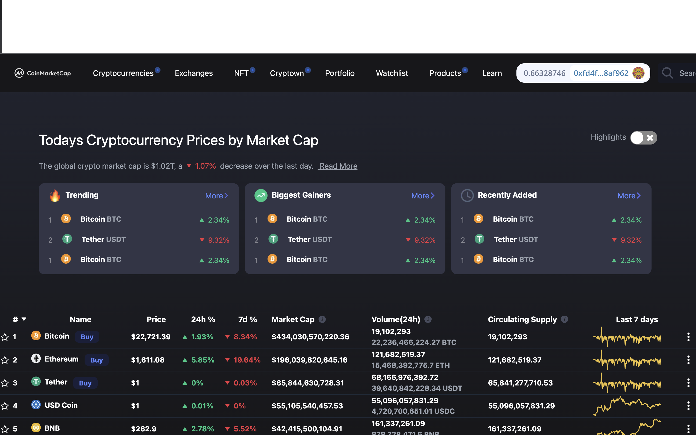

# Coinmarketcap-clone

## Coinmarketcap

CoinMarketCap is a website that provides cryptocurrency market cap rankings, charts, and more. Their website tracks capitalization of various cryptocurrencies by listing prices, available supply (amount of coins/tokens that is currently in circulation), trade volume over last 24 hours, or market capitalizations. The website has historical snapshots, currency converter calculator, crypto glossary, API service, events calendar, and offers a watchlist for users to personalize. The website also has a special cryptocurrency price ticker widget for other sites. The website is aggregating prices of cryptocurrencies and calculating price averages that are displayed to users.

## Poject Description

### Services

These tabs help to explore the cryptocurrency in more detail.

- Charts – chart of prices for the selected token, which are collected using the site and are given to the average value. Remember that this is the best price on the interval, it is unlikely that you will be able to buy bitcoins, altcoins or tokens on it. Why? These are prices for the past period, they are no more.
- Markets – a list of cryptocurrency exchanges where you can buy and sell tokens. Here are not all the existing trading platforms, but only those that are connected to the service and regularly synchronized with the database of the site. However, I recommend beginners to choose only those exchanges that are presented here. It's safer.
- Social – a selection of recent records from social networks, which includes the studied cryptocurrency. It is extremely useful for an investor to look into the Internet At the time of a sharp fall or rise in price in order to understand the reasons for this movement of the rate (and not to succumb to stupid throws).
- Tools – here you can get a free widget for the site, which will show the latest data about the token. An example of this widget you can see on the right side of our site – where the information about Bitcoin.
  -Historical Data – records of quotes with the ability to sort by time intervals. The information can be useful if you want to check the correlation between several cryptocurrencies (later we will publish instructions on how to make it easier if you are creating an investment portfolio).

# Project Results

### COINMARKETCAP CLONE LINK

- https://coinmarketcap-clone-blockchain-mrblack.netlify.app

# Getting Started

### Dependencies

- please install all the dependencies using yarn install

### Installing

- clone this repository by using git clone https://github.com/judinilson/coinmarketcap-clone.git
- then cd/opensea-clone folder then install the dependencies
- then cd/smart-contract folder then install the hardhat dependencies

### Executing program

- To run it use the following command
- for server npm run dev
